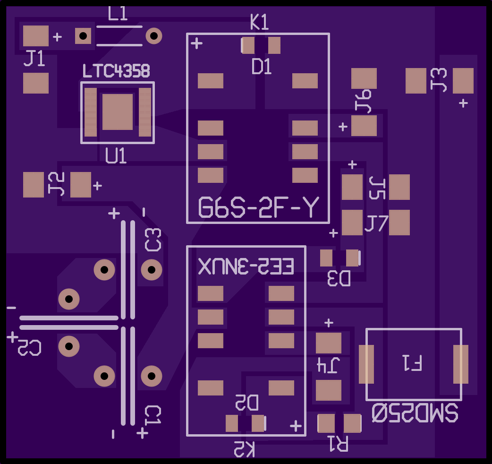
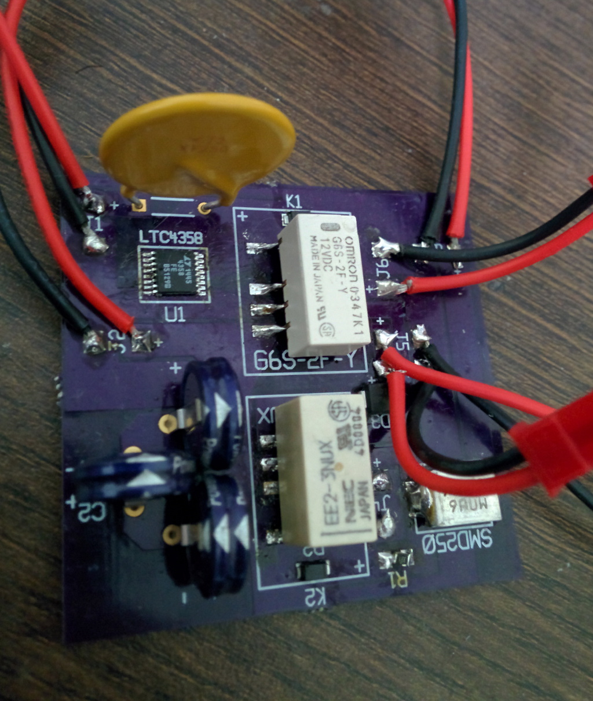
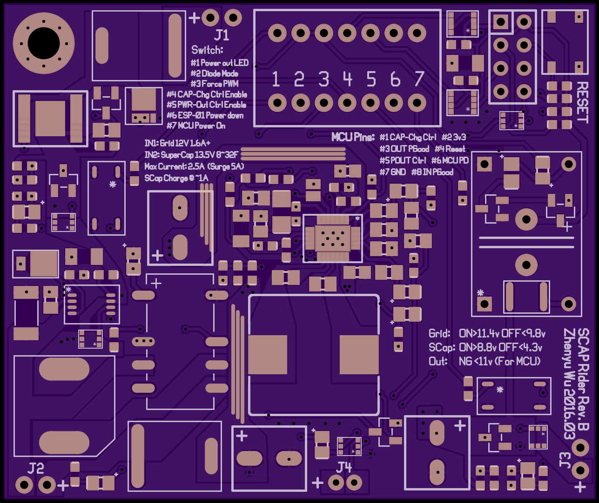
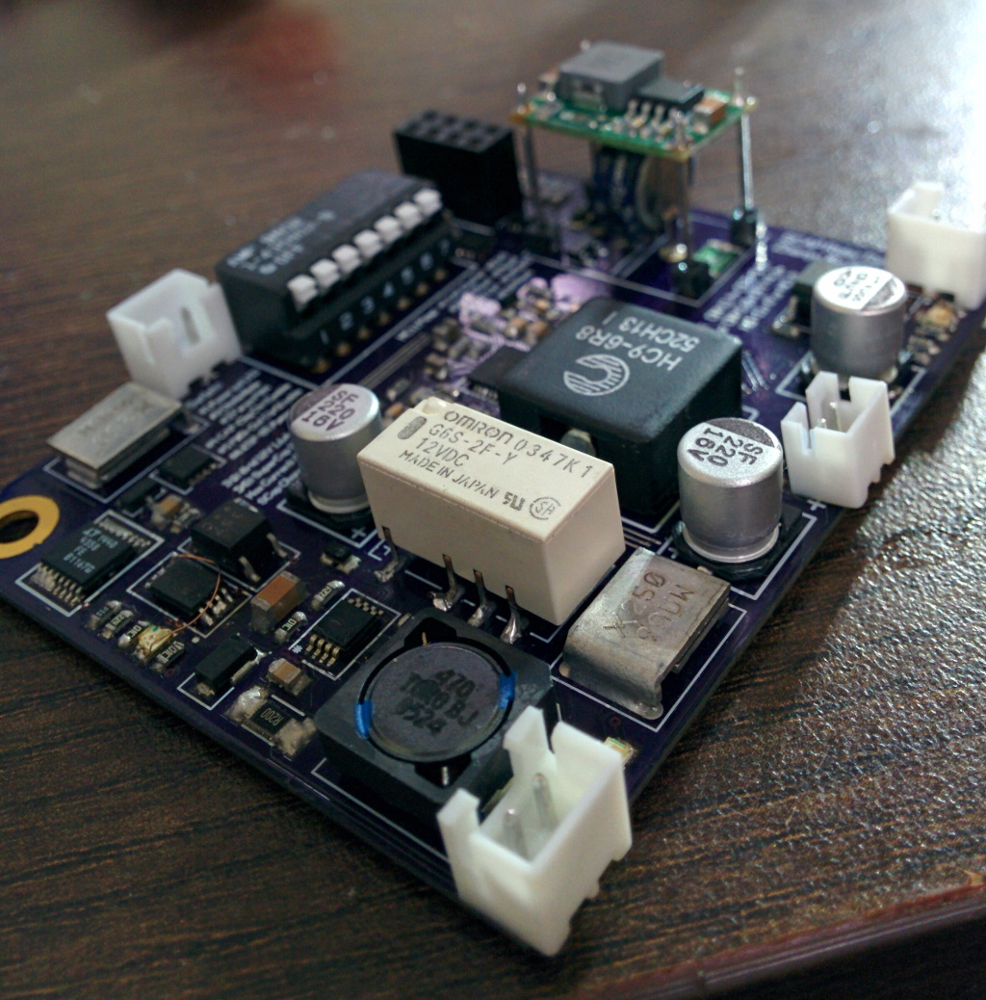

# Table of Content
1. [Prologue](#prologue)
2. [Solution Space](#solution-space)
  1. [Battery-based Solutions](#battery-based-solutions)
  2. [SuperCapacitor-based Solutions](#supercapacitor-based-solutions)
3. [Current Design](#current-design)
  1. [Version History](#version-history)
  2. [Layout Software Used](#layout-software-used)
4. [License](#license)

---

# Prologue
You just set up a nice shiny surveillance IP camera, and now you have a 24x7 view to your important asset.
And your camera has motion detection with recording, and can even shoot you an email when something interesting happens.

Brilliant!

But the next question soon comes: you camera needs power to operate, constant power.
If power goes black or brown, or even flickers a bit, the camera will lose ability to view, record as well as detect events for a period of time.
And you won't get an email if this happens.

What about battery? Well, the power consumption of a camera is moderate at best, not something you can shovel a battery or two and forget about it for a couple of months.
The power should come from the wall.

OK, you are serious about the robustness of your surveillance, you got a backup generator.
But it still won't give you uninterrupted surveillance, because when power fails, backup generators need some time to kick in.
And you would still be blinded during generator startup, unless you do something about it.

You need an uninterruptible power supply (UPS).

Or to be more precise (and sounds classy), [Under-Voltage Ride Through (UVRT)](https://en.wikipedia.org/wiki/Low_voltage_ride_through).

---

# Solution Space
## Battery-based Solutions
### Commercial Off-The-Shelf UPS
Sealed-Lead-Acid (SLA) battery-based UPSs are commodities. You can grab a decent one from Amazon or eBay for $80~$100.

However, they are not ideal for the job:

1. They are heavy. You cannot mount it on walls -- if one fell off somehow, on your foot, you probably can kiss one or two of your toes goodbye.
2. They are bulky. You need to reserve a dedicated space to install one, a space you won't have under a soffit or in a hallway.
3. They are inefficient. The DC power stored in battery is first converted to AC, and then back to DC for your camera. Overall, you get 50~60% efficiency if you are lucky.

### Custom UPS
Direct Current (DC) UPS, combined with Lithium family batteries are available, however, not so "commodity".
For example you can buy [OpenUPS boards](http://www.mini-box.com/OpenUPS), and hook up with batteries of your choice, such as LiPo, or LiFePO4.
With this combination, you can DIY a solution with lighter weight, reduced space footprint, and much better efficiency (by avoiding DC-AC-DC conversions).

However, the biggest problem with this type of solution is safety.
Chemical batteries are capable of storing a HUGE amount of energy, and if not handled carefully, they usually end up in disasters. Compared with commercial products, DIY solutions usually have inferior protections against physical hazards, such as vibration, puncture, water, etc. And lithium batteries, compared with Lead-Acid, are [much more volatile](http://batteryuniversity.com/learn/article/lithium_ion_safety_concerns). Combining these two factors, it is not hard to conclude that is it not wise to put Lithium battery based custom UPS near important assets.

## SuperCapacitor-based Solutions
[SuperCapacitors](https://en.wikipedia.org/wiki/Supercapacitor) are rising alternative energy storage devices.

Compared with batteries, super capacitors have following advantages:

1. Higher specific energy (read: lighter weight for the same energy stored)
2. Better endurance (higher recharge cycles, deeper discharge, faster recharge, no memory effect, etc.)
3. Physical Stability ([very limited consequence](https://www.unece.org/fileadmin/DAM/trans/doc/2008/ac10c3/UN-SCETDG-34-INF38e.pdf) from physical abuse)

These advantages mean that it is easier, and safer to mount super capacitor as energy storage near important assets.

Of course, there are also disadvantages, with the major one being much lower energy density (read: more space for the same energy stored). However, for the specific scenario of ride-through during generator startup, the lower energy density is not a show stopper -- if the generator will definitely kick in within 1 minute, only have 2~3 minutes of backup power is completely acceptable!

### Commercial Product Availability
I am aware of one (somewhat) commercial product in this class, the [RAM Ultra UPS 8000](http://www.ramtechno.com/articles/13-ram-ultra-ups-8000).
I discovered its availability after I have finished designing V2 and waiting for prototype board.

Naturally, I ordered a couple of them to play with. :)

It is advertised as medical grade backup power supply, designed to mount internally to device chassis.
It does not come with much (any at all) packaging or casing. However, this is not a critical downside, as it is light-weighted, can be mounted to a secure and hard to reach location. And in addition, the energy storage is made of super capacitors, which is much more tolerant to physical abuse than Lithium batteries.

Documentations are very scarce, but eventually I am able to verify its functionality.
And I found it has some desired features, and also some lacking ones.

1. It has rate controlled charging circuit. This is important, because super capacitors, unlike batteries, have very low internal resistance. When applied a voltage without current control, the current blow off the roof, and can easily damage the power supply.

  However, the default charge rate was set too high, peak around 6~8 Amps. I blew a 3A fuse shortly after trying to charge one up. (Yes, I put fuse everywhere, guess how I learned to do that... :D) I modified it to ~2A.
2. It has charge voltage limit, to prevent overvoltage on the capacitors. The default limit is also a little to high in my opinion, at slightly above 10.8V for 4x2.7v capacitors. I modified it to 10v, try to prolong the life of the capacitors.
3. It does NOT have under-voltage sensing, or automatic backup trigger. Instead, it has a PGOOD input, which has to be asserted low **before** the power input is lost, in order to kick in the backup circuit.

  This is a **major downside**, meaning that it cannot be directly applied as a UVRT power supply. Additional supervisory circuit is needed to achieve this goal.

---

# Current Design
My design incorporates four major features that I deem important for the applicable scenarios.

1. Autonomous Operation: the circuit is able to achieve power failover and recharge of backup reserve by itself without external assist.
2. Rate controlled charging: Make sure charging of backup reserve does not overload the up-stream power supply.
3. Output regulation: To efficiently extract energy in super capacitors, buck-boost output voltage regulation is provided.
4. "Smart" and Internet-enabled: When power events happen (such as power failure and restoration, backup reserve depletion), you could programmatically respond to those events, such as getting email notifications, asserting alarms (to cameras), etc. This is made possible thanks to the all-mighty tiny WiFi SoC, ESP8266.

## Version History
* V0 never made it to the sun.

  Back in early 2015, I never learned PCB design at that time.
  I was trying to prototype *by hand* using breadboards PCBs, not a very good idea with more than 5 nets and 20 solder points.
  Clearly, custom PCB is the way to go. I therefore started to learn how to design PCBs

* V1 was mostly based on diodes and relays.

  Two months later, actually my first PCB, ever. :)

   

  It does not handle capacitor charging rate control, output voltage regulation, or MCU integration.
  The first two functions were to be achieved by external modules, such as [PT4115 constant current driver](https://www.google.com/search?hl=en&site=imghp&tbm=isch&source=hp&q=constant+current+driver+board+with+PT4115), and [adjustable boost regulators](https://www.google.com/search?hl=en&site=imghp&tbm=isch&source=hp&q=boost+regulator+module).

  There is one design issue -- double-throw relays are usually break-before-make, so they have a total disconnection state, when the switches change states from one to another. However, for electro-magnetic mechanical relays, if the voltage change is slow enough, the total disconnection state can be quite long, up to several minutes!

* V2 is a complete overhaul.

  As you can see, it looks significantly more sophisticated and mature than V1.

   

  It was completed 10 months after I started PCB designing. At that point I have already successfully done over 8 smaller projects, involving experiment with many SMPS, for my [ESP8266 battery powering project](https://github.com/Adam5Wu/Micro-power-SMPS).
  
  This version boasts built-in capacitor charging rate control, output voltage regulation, and MCU integration.
  Only one mechanical relay is used, in order to reduce PCB footprint and increase reliability of controls.

  A minor design flaw was uncovered during prototype assembly -- the current path control should draw voltage before indicator LED, not after, as LEDs are diodes, which incur voltage drops, and thus rendered the control signal unreliable. The rendered PCB image above already corrected the problem.

* V3 is currently being designed.

  It is an improved version of V2, on the following aspects:
  
  1. Completely eliminate mechanical relay use
  2. Increased voltage hysteresis for super capacitor, from 4.3v-off-5v-on to 4.3v-off-8.8v-on
  3. Configurable power out soft-start -- no power out until capacitor reaches 8.8v
  4. Ability to power off MCU circuits

## Layout Software Used
PCBWeb http://www.pcbweb.com/

---

# License
The circuit design and PCB layout is released under GPL license.
Proprietary licensed release is available upon request.

